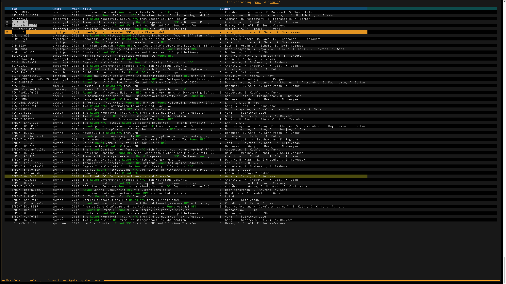

# citerus
A command-line tool to easily find cryptographic citations to use with LaTeX.

                           .-.
                          /  .\
                        .' .  .'.
                     .-'. .    . '-._
                   .' ..    . . . .  '.
                  /. .    .        .  .\
                 / .  . .     . .. . .  \
                |. .  .      .. . . ...  |
                / . .     .       .  .  .\
               | . . ._______ .. . .  . ..|
               |   . /       \ .   . .  . |
               |. . { CITERUS }. ..   . ..|
               |.  . \_______/.     .   ..|
               | .  .          . . . . .  |
               |. .     .    .. .   .   ..|
                \  . .        .  . .  . . /
                |  .  .      .  .  . . . |
                 \. .     .  . .  .. . .'
                  \  ..      .. .   . /
                   ':_ .  .  . ... _.'
                      '-.. . .  .-'
                          '._..'

# What does Citerus do?

Citerus retrieves your citations. 

(_How do I pronounce it?_ Like so: /saɪt.rəs/)

When writing cryptographic papers, authors often use the excellent [cryptobib](https://cryptobib.di.ens.fr/) database. Since it consists of a large file, it is not often convenient to search in it. If you like the command line but you find grep awkward then citerus might be for you.

**Example:** 
Suppose you want to find relevant citations for _round complexity in MPC_, just:
- Type `citerus mpc round` in your terminal
- Select all the papers that you find relevant (see screenshot). Exit the program.

Citerus will automatically copy in your clipboard the relevant LaTeX code to cite them.
That's it!

To see more options and examples type `citerus --help`.

# Installing
`pip install citerus`

If you don't have pip, install it first with `python -m ensurepip --upgrade`.

Citerus has been tested on macOS, GNU/Linux and Windows. Windows users may need to make sure that the installed citerus script is in PATH following some of the tips [here](https://superuser.com/questions/1372793/the-script-is-installed-in-directory-which-is-not-path).

## Distribution packages

- Arch (AUR): [python-citerus-git](https://aur.archlinux.org/packages/python-citerus-git)

# Ack
Thanks to Mahak P. for coming up with the specific form of the citerus name.
